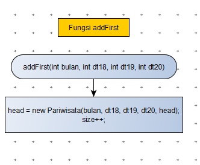

# Laporan Quiz 2 Praktikum Algoritma Struktur Data

## NIM : 1941720057 
## Nama : M.Syifa'ul Ikrom Almasyriqi

## Screenshoot kode program :
Class Pariwisata

Class LinkedListPariwisata

Class PariwisataMain

Output Program

## Flowchart :
Class Pariwisata

Pada class pariwisata terdapat atribut data18, data19, data20, bulan, dan next. Terdapat juga konstruktor yang berfungsi untuk mengisi nilai pada atribut.

Class LinkedListPariwisata

Pada class ini terdapat atribut dan konstruktor. Deklarasi atributnya adalah head dan size. Konstruktor digunakan untuk mengisi nilai head dengan null dan size dengan 0 untuk menandakan bahwa linked lists masih kosong.

Fungsi isEmpty digunakan untuk mengecek apakah linked list masih kosong dan menggunakan nilai kembalian head yang bertipe data boolean.

Fungsi addFirst digunakan untuk menambah data di awal linked lists.

Fungsi add dimulai dengan mengecek indeks apakah kurang dari nol atau lebih dari size. Jika iya maka akan keluar output index di luar batas. Jika tidak maka akan melakukan penambahan data sesuai indeks yang dimasukkan pada parameter.

Fungsi addlast dimulai dengan mengecek fungsi isEmpty, jika isEmpty bernilai true maka akan dilakukan fungsi addFirst, jika tidak maka akan dilakukan penambahan data di akhir linked list.

Fungsi getFirst digunakan untuk mendapatkan data di awal elemen linked lists.

Fungsi getLast digunakan untuk mendapatkan data di akhir elemen linked lists.

Fungsi clear digunakan untuk menghapus semua data yang ada di linked list sehingga linked list kosong.

Fungsi print digunakan untuk mencetak bulan, data di tahun 2018, data di tahun 2019, dan data di tahun 2020.

Class PariwisataMain

Pada class ini dibuat instansiasi objek dari class LinkedListPariwisata yang bernama data dan memanggil beberapa fungsi yang berada di class LinkedListPariwisata yaitu fungsi addFirst, add, addLast, dan print.