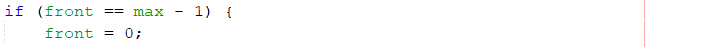

# Jawaban Pertanyaan 10.3.3 Praktikum Queue

1. Pada class Queue fungsi dari atribut Q adalah menyimpan data array queue.

2. Pada class Queue fungsi dari atribut max adalah untuk menyimpan banyak data maksimal yang bisa disimpan di dalam queue. Fungsi atribut size adalah untuk menyimpan berapa banyak data yang ada dalam antrian. Fungsi atribut front adalah untuk menyimpan nilai indeks array data terdepan. Fungsi atribut rear adalah untuk menyimpan nilai indeks array data paling belakang.

3. Pada method Create, atribut front dan rear diinisialisasikan dengan nilai -1 karena tidak menunjuk ke data manapun dan itu berarti antrian masih kosong. Tidak inisialisasikan 0 karena 0 termasuk indeks pada array data queue dan menandakan antrian tidak kosong.

4. Pada method IsFull, jika kondisi diubah menjadi size == max-1, maka antrian akan dianggap full walaupun sebenarnya pada data array masih ada yang kosong 1 indeks. Hal ini terjadi karena jika nilai size sama dengan nilai max-1 maka queue dalam kondisi penuh dan tidak dapat diisi lagi.

5. Kode program pada method Enqueue

Fungsi dari potongan kode tersebut adalah untuk mengecek kondisi apakah posisi rear berada pada indeks terakhir array atau tidak. Jika benar, maka posisi rear selanjutnya adalah di indeks 0.

6. Pada method Enqueue, baris kode program yang menunjukkan bahwa data baru disimpan pada posisi terakhir di dalam queue adalah

7. Method Dequeue mempunyai tipe kembalian int karena data yang ada di indeks front akan diambil dan di return-kan pada proses Dequeue. Tidak bertipe void karena tipe void tidak dapat mengembalikan nilai, sedangkan pada proses Dequeue diperlukan pengembalian nilai data di indeks front.

8. Pada method Queue, baris kode program yang menunjukkan bahwa data yang dikeluarkan adalah data pada posisi paling depan di dalam queue adalah

9. Kode program pada method Dequeue

Fungsi dari potongan kode tersebut adalah untuk mengecek kondisi apakah posisi front berada pada indeks terakhir array atau tidak. Jika benar, maka posisi front selanjutnya adalah di indeks 0.

10. Pada method Dequeue, baris kode program yang menunjukkan bahwa data terlebih dahulu disimpan variabel lain sebelum diambil/dihapus adalah

11. Pada method print, pada proses perulangan variabel i tidak dimulai dari 0(int i=0) melainkan int i=front karena belum tentu data paling depan ada di dalam indeks 0 bisa saja sudah dikeluarkan melalui proses Dequeue. Oleh karena itu, variabel i dimulai dari front agar semua data ditampilkan dan tidak ada data yang kosong ditampilkan.

12. Kode program pada method print

Maksud dari potongan kode tersebut adalah mengubah nilai i menjadi (i+1) % max. Contohnya seperti ini jika i=0 dan max=5, maka nilai i = (0+1) % 5, nilai i = 1 % 5, maka nilai i=1.

13. Modifikasi program menambahkan method baru bernama peekRear dan menambahkan daftar menu sehingga method peekRear dapat dipanggil berada pada project netbeans Jobsheet10 package minggu10 nama file ModifQueue.java dan ModifQueueMain.java

