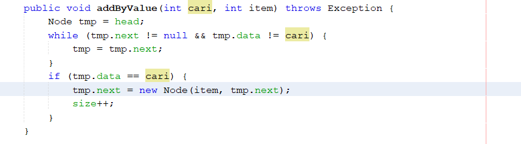
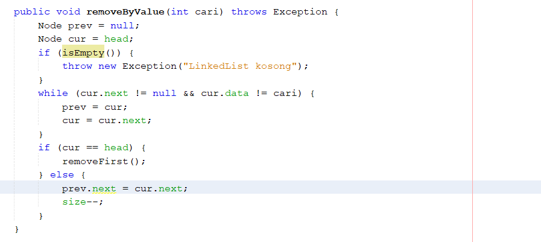

# Jawaban Pertanyaan 11.3.3 Percobaan Linked Lists

1. Pada proses traverse nilai head disimpan terlebih dahulu dalam variabel tmp agar tidak merubah referensi dari head.

2. Kekurangan implementasi single linkedList tanpa penunjuk tail adalah pada operasi addLast dan getLast masih diperlukan proses traverse yaitu proses melewati dimulai dari awal data (head) sampai menjumpai null. Padahal jika menggunakan penunjuk tail tidak diperlukan proses traverse dan kompleksitas waktu lebih rendah.

3. Implementasi method addByValue berdasarkan nilai yang dicari berada pada project netbeans Jobsheet11 package percobaan nama file LinkedList.java dan MainLinkedList.java

4. Implementasi method removeByValue berdasarkan nilai yang dicari berada pada project netbeans Jobsheet11 package percobaan nama file LinkedList.java dan MainLinkedList.java

5. Modifikasi menu serta submenu dan inputan dinamis(semua tipe data) pada program berada pada project netbeans Jobsheet11 package percobaan nama file ModifLinkedList.java, ModifNode, ModifMainLinkedList.java