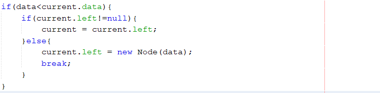

# Jawaban Pertanyaan Binary Tree

1. Dalam Binary search tree proses pencarian data bisa lebih efektif dilakukan dibanding binary tree biasa karena Binary Search Tree memiliki sifat bahwa semua left-child harus lebih kecil daripada right child dan parentnya. Jadi, lebih mudah melakukan pencarian karena seluruh children dari tiap node terurut.

2. Pada class Node, kegunaan dari atribut left adalah sebagai pointer yang menunjuk ke left-child dan kegunaan dari atribut right adalah sebagai pointer yang menunjuk ke right-child.

3. a. Kegunaan atribut root adalah sebagai akar atau node awal pada binary tree dan tidak memiliki predessor maupun parent.
b. Ketika objek tree pertama kali dibuat, nilai dari root adalah null yang berarti tidak ada.

4. Ketika tree masih kosong dan akan ditambahkan sebuah node baru, maka proses yang akan terjadi adalah operasi add akan dijalankan dan nilai root yang semula null akan diubah menjadi node baru yang berupa data.

5. Pada method add() terdapat baris program

Pada awal baris program dilakukan pengecekan apakah data<current.data (data = data yang akan ditambahkan dan current.data = root). Jadi, jika data yang ditambahkan kurang dari nilai root maka akan dilakukan pengecekan pada child sebelah kiri root. Setelah itu akan masuk ke pengecekan apakah current.left!=null, maksud pengecekan ini adalah jika child sebelah kiri root tidak null maka nilai current akan diubah menjadi current.left atau child sebelah kiri root. Sedangkan, jika child sebelah kiri root adalah null (current.left=null) maka current.left akan diubah menjadi node baru berupa data yang ditambahkan, selanjutnya akan dilakukan break untuk menghentikan program dan pernyataan dalam while tidak akan dieksekusi kembali.

6. Perbedaan antara traverse mode pre-order, in-order, dan post-order adalah pada letak statement pencetakan data yg dikunjunginya. Pada mode pre-order cetak data yang dikunjungi dahulu, kunjungi left-child, kemudian baru kunjungi right-child (statement cetak dilakukan sebelum mengunjungi left-child dan right-child). Pada mode in-order kunjungi left-child terlebih dahulu, cetak data yang dikunjungi, kemudian kunjungi right-child (statement cetak dilakukan setelah mengunjungi left-child dan sebelum mengunjungi right child). Pada mode post-order kunjungi left-child dahulu, kunjungi right-child, kemudian cetak data yang dikunjungi (statement cetak dilakukan setelah mengunjungi left-child dan right-child).

7. Pada method delete(), sebelum proses penghapusan node, didahului dengan proses pencarian node yang akan dihapus (current) dan parent yang akan dihapus (parent). Menurut saya mengetahui parent dari node yang akan dihapus diperlukan karena dengan mengetahui parentnya kita dapat mengetahui letak node yang akan dihapus (current) dengan membandingkan nilai parent dengan nilai node yang akan dihapus. Jika nilai node yang akan dihapus lebih kecil daripada parent maka letak node yang akan dihapus adalah child sebelah kiri parent, sedangkan jika lebih besar maka letak node yang akan dihapus adalah child sebelah kanan parent. Kegunaan lain mengetahui parent dari node yang akan dihapus adalah kita bisa mengubah nilai pointer left atau right dari parent yang semula menunjuk ke node yang akan dihapus (current) diubah menjadi menunjuk ke null (jika current tidak memiliki child), menunjuk ke child dari node current (jika current memiliki 1 child), menunjuk ke node paling kecil dari subtree sebelah kanan node current (jika current memiliki 2 child).

8. Dalam method delete(), variabel isLeftChild yang bertipe data boolean digunakan untuk mengetahui letak dari node yang akan dihapus apakah berada pada child di sebelah kiri parent (left-child) maka variabel isLeftChild bernilai true dan jika berada pada child di sebelah kanan parent (right-child) maka variabel isLeftChild bernilai false.

9. Method getSuccessor digunakan untuk mendapatkan successor dari node yang akan dihapus yang nantinya akan digunakan ketika proses penghapusan node yang memiliki 2 child.

10. Di ulasan teori, disebutkan bahwa successor bisa didapat dengan 2 cara, yaitu 1) mencari nilai terbesar dari subtree di sebelah kirinya, atau 2) mencari nilai terkecil dari subtree sebelah kanannya. Dalam method getSuccessor() di program yang dilakukan pada percobaan cara yang diimplementasikan adalah cara 2 yaitu mencari nilai terkecil dari subtree sebelah kanannya, hal itu bisa kita lihat dari statement Node successor = del.right; dari statement tersebut bisa diketahui bahwa successor yang dicari dimulai dari subtree sebelah kanan node yang akan dihapus.

11. Pada class BinaryTreeArray kegunaan dari atribut data adalah sebagai array yang menyimpan data dengan tipe data integer dan atribut idxLast digunakan untuk menyimpan data indeks terakhir data array yang merupakan leaf paling kanan binary tree dengan tipe data integer.

12. Kegunaan dari method populateData() adalah untuk mengisi atribut data dan idxLast. Method traverseInOrder digunakan untuk mencetak data secara in-order yaitu secara rekursif mengunjungi left-child terlebih dahulu, cetak data yang dikunjungi, kemudian baru mengunjungi right-child.

13. Suatu node binary tree disimpan dalam array indeks 2, maka posisi left-child berada pada indeks: 2*indeks+1 = 2*2+1 = 5 dan posisi right-child berada pada indeks: 2*indeks+2 = 2*2+2 = 6. Jadi posisi indeks left-child dan right child masing-masing adalah 5 dan 6.