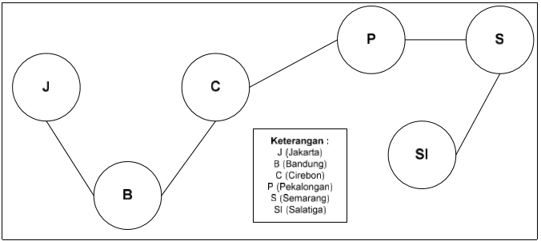

# Jawaban Pertanyaan 15.3.3

1. Graph diimplementasikan dengan double linked list, bukan single linked list karena pada graph dibutuhkan dua pointer pada setiap node atau vertex untuk menunjuk ke vertex selanjutnya dan menunjuk ke edge yang terhubung. Pointer yang digunakan adalah atribut prev dan next seperti pada double linked list. Pada graph atribut prev digunakan sebagai pointer untuk menunjuk ke vertex selanjutnya (sesuai urutan masuknya vertex ke linked list), kemudian atribut next digunakan sebagai pointer yang menunjuk ke edge yang terhubung dengan vertex tersebut jika vertex tersebut memiliki edge.

2. Terdapat dua jenis loop dalam metode printGraph(). Loop yang pertama dilakukan untuk melakukan perulangan pada i dimana i digunakan untuk memanggil indeks array of object yang objectnya berupa linked list yang berisi vertex, edge, dan vertex yang terhubung dengan edge. di dalam loop pertama ini juga terdapat pengecekan apakah vertex yang sesuai indeks i memiliki edge yang terhubung dengan vertex lain atau tidak. Jika iya maka akan masuk ke loop yang kedua. Loop yang kedua digunakan untuk melakukan perulangan pada j, dimana j digunakan untuk memanggil dan mencetak vertex apa saja yang terhubung dengan edge pada setiap vertex ke-i.

3. Perbedaan Graph dengan Binary Tree pada implementasinya menggunakan linked list adalah pada Graph node atau vertex dapat terhubung dengan banyak vertex yang lain sesuai dengan yang diinginkan. Sedangkan, pada binary tree setiap node hanya maksimal memiliki satu parent yang terhubung dan maksimal memiliki 2 child yang terhubung dan tidak bisa asal menghubungkan satu node dengan node yang lain karena terdapat aturan bahwa tree sebelah kiri harus lebih kecil dari tree sebelah kanan.

4. Perbedaan edge dan path adalah edge hanya sebagai penghubung antar simpul dalam graph. Sedangkan path adalah lintasan yang dilalui dari satu vertex ke vertex yang akan dituju melalui edge yang terhubung. Contohnya seperti gambar di bawah ini

Dari gambar di atas dapat diketahui 5 edge yaitu (J,B), (B,C), (C,P), (P,S), (S,SI). Sedangkan, untuk contoh path misalnya lintasan J ke P, yang dapat kita sebut sebagai lintasan (path) JBCP adalah lintasan (path) dari simpul J ke P.

5. • Adjacency list, dan diimplementasi dengan menampilkan masing-masing simpul sebagai sebuah struktur data yang mengandung senarai dari semua simpul yang saling berhubungan.

    • Adjacency matrix dimana baris dan kolom dari matriks (jika dalam konteks implementasi berupa array dua dimensi) tersebut merepresentasikan simpul awal dan simpul tujuan dan sebuah input di dalam array yang menyatakan apakah terdapat sisi di antara kedua simpul tersebut

    • Dari kedua implementasi diatas, gabungan dari keduanya menghasilkan implementasi baru bernama Adjacency map yaitu simpul yang disimpan sebagai kunci dalam sebuah Map Structure dengan tujuan agar mempermudah pencarian sebuah simpul

6. Algoritma yang menggunakan dasar graph:

    •Algoritma Dijkstra, digunakan untuk menentukan lintasan terpendek pada graf berbobot.
    
    •Algoritma Brent, digunakan untuk menentukan adanya daur dalam graph (cycle)

    •Algoritma Prim, digunakan untuk mencari pohon rentang minimum untuk sebuah graf berbobot yang saling terhubung

7. Pada class Graph terdapat array bertipe LinkedList, yaitu LinkedList list[]. Tujuan pembuatan variabel tersebut adalah untuk membuat array of object dari class LinkedList dimana array list[] ini akan digunakan untuk menyimpan data vertex, edge, dan vertex yang terhubung dengan edge pada graph.

8. Alasan pemanggilan method addFirst() untuk menambahkan data, bukan method add jenis lain pada linked list ketika digunakan pada method addEdge pada class Graph adalah agar vertex source atau asal dari edge pointer nextnya menunjuk ke node baru yang merupakan edge kemudian pointer prev dari edge akan menunjuk ke vertex destination atau tujuan dari edge. Sehingga jika data edge yang terhubung dengan vertex source ditampilkan maka data yang terbaru akan ditampilkan terlebih dahulu karena menggunakan method addFirst().

9. Cara mendeteksi prev pointer pada saat akan melakukan penghapusan suatu edge pada graph adalah dengan cara melakukan pengecekan di dalam perulangan i, jika i sama dengan parameter destination, maka prev pointer akan diubah dan edge akan dihapus.

10. Pada praktikum 15.3 langkah ke-12 untuk menghapus path yang bukan merupakan lintasan pertama kali menghasilkan output yang salah karena pada method removeEdge() di dalamnya menggunakan method remove dari linked list dimana parameter method remove menghapus berdasarkan indeks bukan berdasarkan nilai destination. Jadi solusinya yaitu mencari indeks dari nilai destination dan memasukkannya ke dalam parameter remove.
Method untuk mencari nilai destination berada pada project netbeans Jobsheet15 package Praktikum1 nama file LinkedLists.java, berikut screenshot methodnya

Method removeEdge() yang dimodifikasi berada pada project netbeans Jobsheet15 package Praktikum1 nama file ModifGraph.java, berikut screenshot removeEdge()

Berikut hasil output yang benar:

# Jawaban Pertanyaan 15.4.3

1. Perbedaan degree pada directed dan undirected graph adalah pada jenis degreenya pada directed graph terdapat 3 jenis yaitu indegree yaitu edge yang masuk ke vertex, outdegree yaitu edge yang keluar dari vertex, dan degree vertex yang merupakan penjumlahan antara indegree dan outdegree. Sedangkan pada undirected graph hanya ada satu degree yaitu jumlah edge yang terhubung dengan vertex.

2. Pada implementasi graph menggunakan adjacency matriks, jumlah vertices harus ditambahkan dengan 1 pada indeks array karena agar dapat mencetak nama vertices saat mencetak representasi graph menggunakan array 2d. Jadi pada satu baris akan terdapat 5 data vertices yang terhubung edge dan ditambah 1 data nama vertices (contoh jumlah data vertices = 5).

3. Kegunaan method getEdge() adalah untuk mendapatkan data edge yang terhubung antara vertex to dan vertex from apakah ada atau tidak.

4. Pada uji coba praktikum 15.4 graph yang dibuat termasuk jenis directed graph.

5. Pada method main harus menggunakan try-catch Exception karena method-method yang digunakan di dalamnya menggunakan throws Exception. Oleh karena itu, untuk mendeteksi kesalahan dan menangkap Exception yang ada ketika menjalankan method-method di dalam method main maka digunakanlah try-catch Exception.