# Laporan Praktikum Brute Force Divide Conquer 2

## Belajar Sisip Gambar
ini adalah contoh gambar
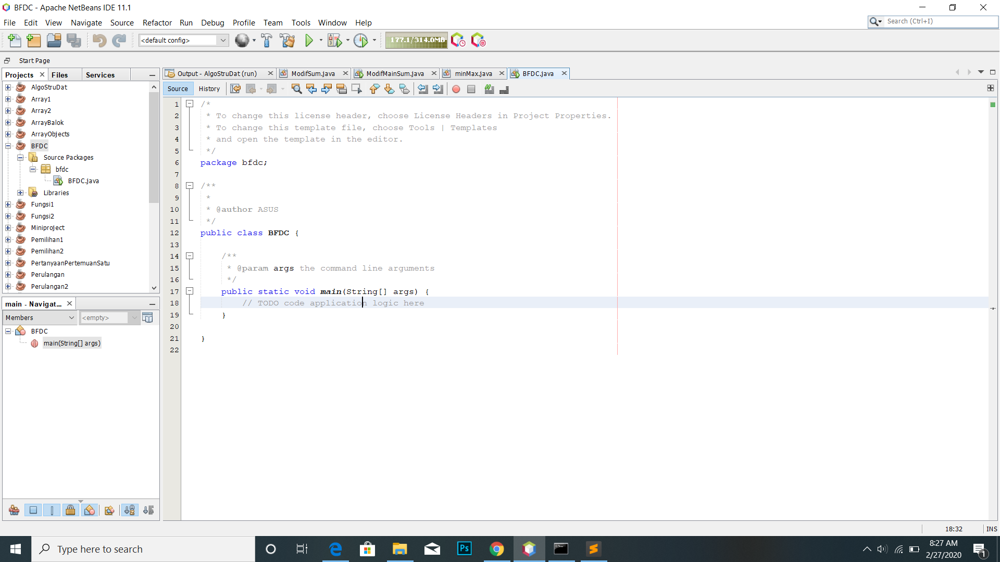

## Latihan Brute Force
Class MinMax
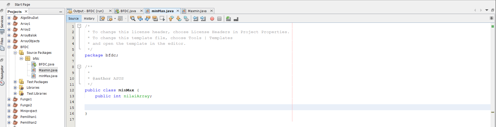

Main Class BFDC Brute force
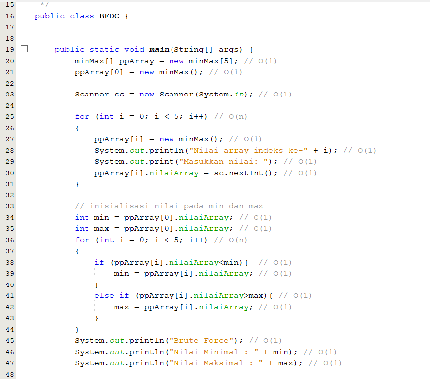 

## Latihan Divide Conquer
Class maxMin
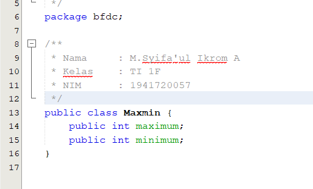

Class minMax Divide Conquer
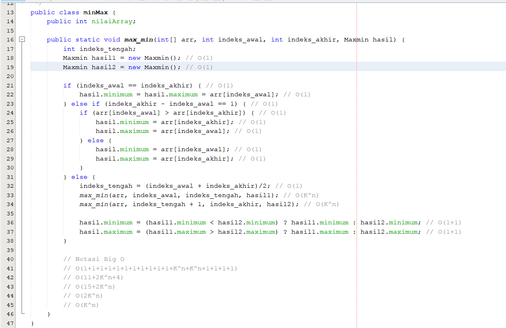

Main Class BFDC Divide Conquer
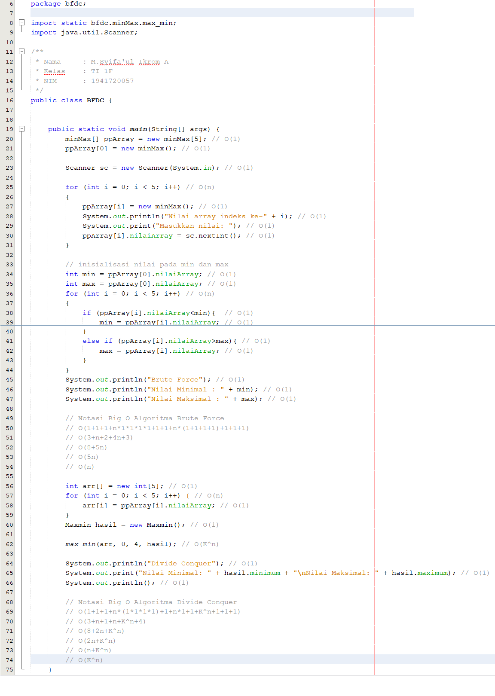

## Screenshot Jawaban Pertanyaan
Menampilkan Hasil Input Array Praktikum 1
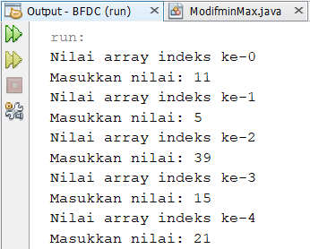

Modifikasi perhitungan nilai minimal dan maksimal terpisah dari class main algoritma brute force
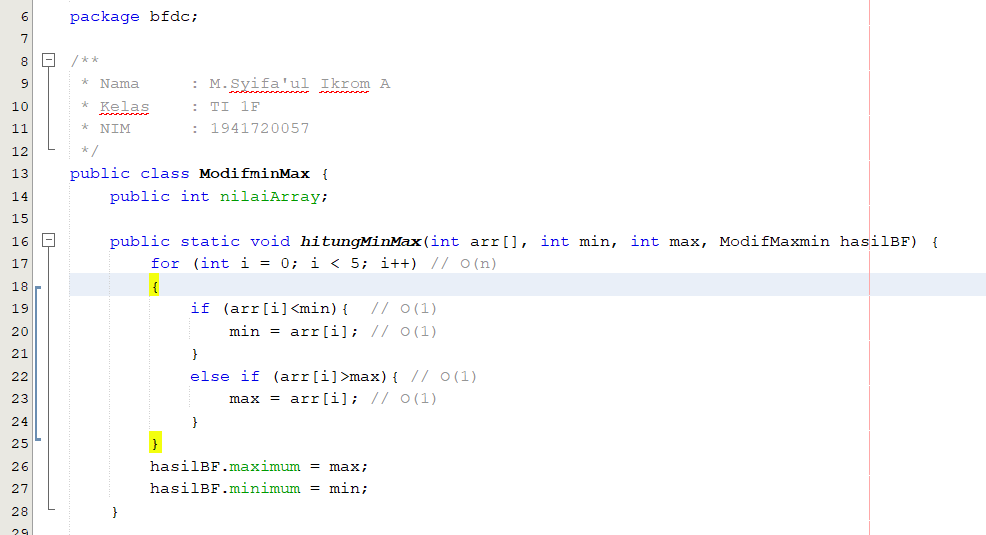

## Tugas Praktikum
1. Notasi Big O Brute Force
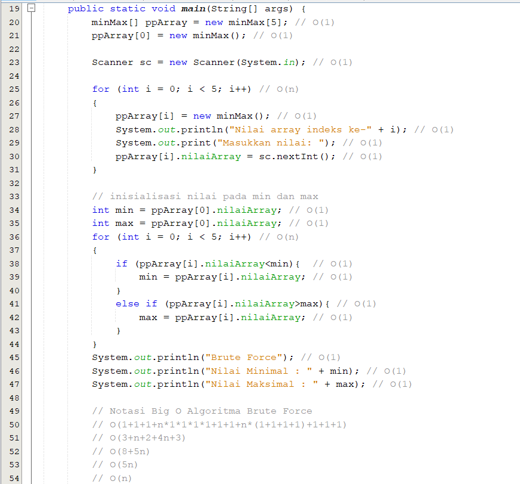
Notasi Big O Divide Conquer
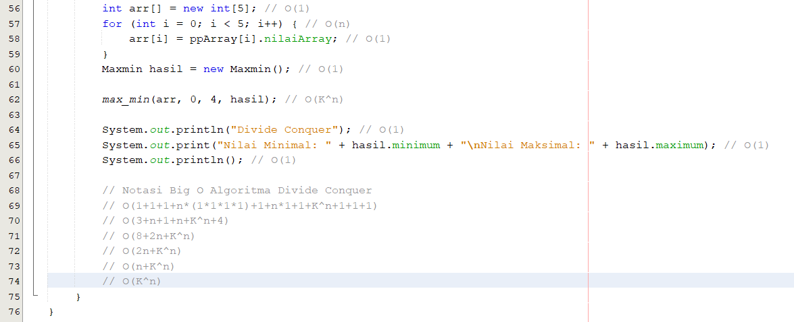

2. Notasi Big O Fibonacci Brute Force
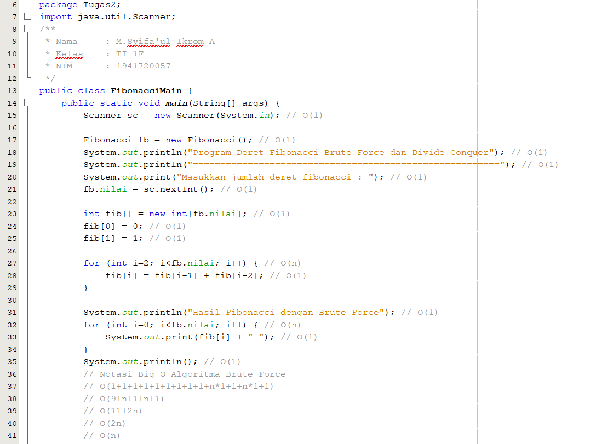
Notasi Big O Fibonacci Divide Conquer
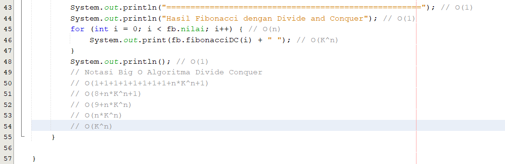
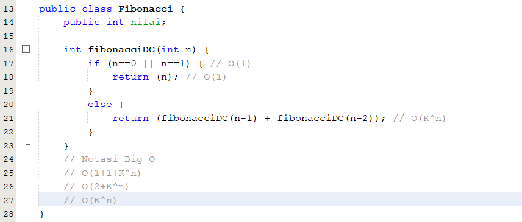

3. Notasi Big O Faktorial Brute Force
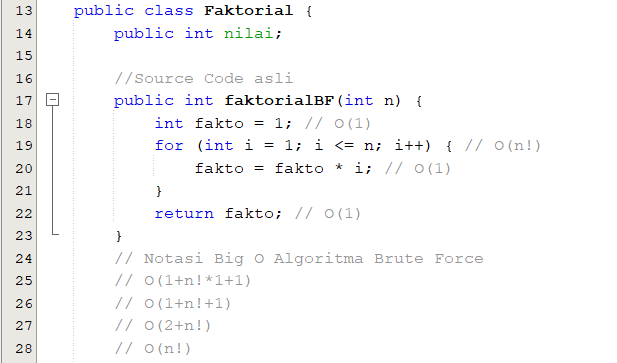
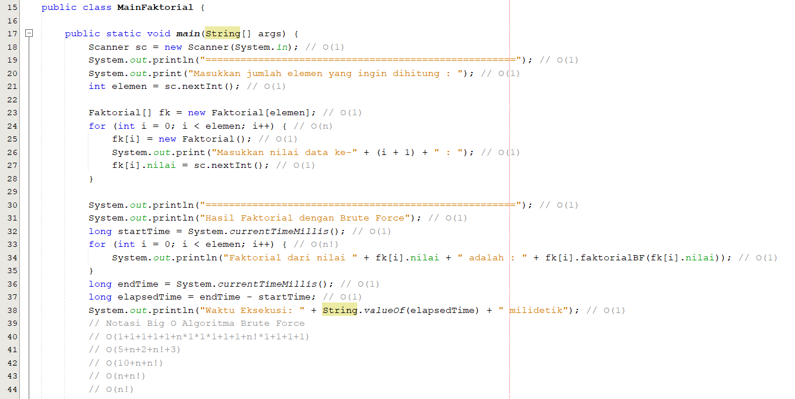
Notasi Big O Faktorial Divide Conquer
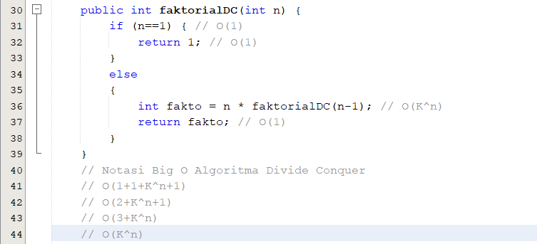
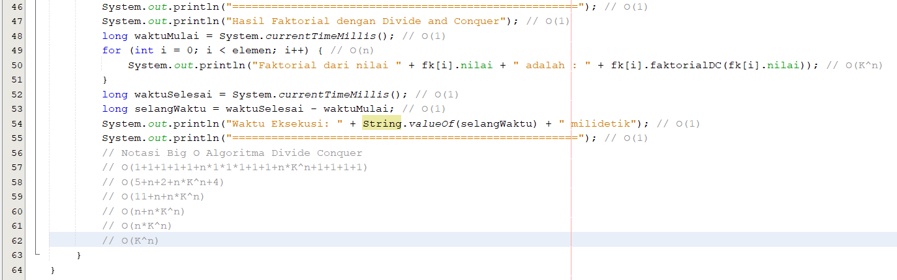