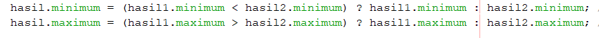
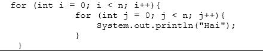

# Jawaban Pertanyaan Praktikum 1-3

1. Menampilkan hasil input array praktikum 1 jawaban di proyek netbeans BFDC folder laporanPraktikum nama file Laporan.md.
2. Pada praktikum 2 perlu dibuat objek 2 kali dari class minMax karena yang pertama untuk membuat array dari objek minMax (instansiasi array of objek) yaitu array ppArray dan yang kedua digunakan untuk membuat objek pada array ppArray indeks ke-0 agar atribut dari array ppArray indeks ke-0 dapat diisi.
3. Modifikasi perhitungan nilai minimal dan maksimal terpisah dari class main algoritma Brute Force jawaban di proyek netbeans BFDC: folder laporanPraktikum nama file laporan.md dan package bfdc nama file ModifBFDC.java dan ModifminMax.java.
4. Arti angka 4 pada kode: max_min(arr, 0, 4, hasil); angka 4 tersebut memiliki arti isi dari parameter indeks_akhir yang mengacu pada fungsi max_min. Jadi, angka 4 tersebut merupakan indeks terakhir dari array yang sudah ditentukan sebelumnya.
5. Nilai indeks awal, indeks akhir, dan indeks tengah diperlukan untuk membagi masalah menjadi beberapa upa masalah pada algoritma divide and conquer, untuk pembagian yang sama antara bagian kanan dan kiri maka memerlukan indeks awal yang merupakan indeks ke-0, indeks akhir yang merupakan indeks ke-(n-1), dan indeks tengah yang merupakan batas diantara keduanya.
6. Class Maxmin harus terpisah karena akan dibuat objek di fungsi max_min yang berada di class minMax dan deklarasi class tidak boleh dilakukan di dalam class lain.
7. Tidak bisa dilakukan karena nilai array pada array objek digunakan sebagai parameter.
8. Tidak ada perubahan kode karena tahap 7 tidak bisa dilakukan
9. Praktikum bagian 4 sejak awal methodnya tidak memiliki nilai kembalian karena methodnya bersifat void
10. Lebih baik algoritma divide conquer karena akses memorinya yang kecil dan memiliki efisiensi algoritma yang tinggi sehingga algoritma yang dihasilkan mangkus
11. Pada praktikum 3 kode: 

Kode tersebut menggunakan operator ternary dan tanda ":" memiliki kegunaan untuk memisahkan pernyataan benar dan pernyataan yang salah.
12. Tanda "?" merupakan bagian dari operator ternary dan tujuan penggunaan tanda "?" adalah sebagai operator kondisi yang menanyakan kondisi yang diberikan apakah bernilai benar atau salah.

# Jawaban Pertanyaan Praktikum 4
1. Pada praktikum 4 perulangan kedua dirubah menjadi

Maka notasinya adalah O(n.n.1) = O(n^2) 
2. Berdasarkan notasi nomor 1, jika n=100 maka O(n^2) = 100^2 = 10000 instruksi
3. Terdapat perbedaan notasi di antara kedua kode tersebut. Pada kode A notasinya adalah O(n.n.1) = O(n^2) sedangkan pada kode B notasinya adalah O(n.∞.1) = O(n.∞). Hal ini terjadi karena pada kode B di inner loop nya terdapat perbedaan dengan kode A yaitu pada perubahan nilainya di kode A perubahan nilainya menggunakan j++ sedangkan di kode B menggunakan i++ sehingga nilai j selalu 0 dan akan terjadi infinity loop. 