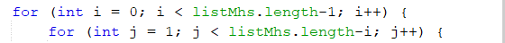
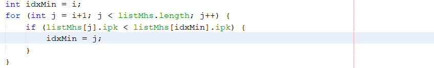
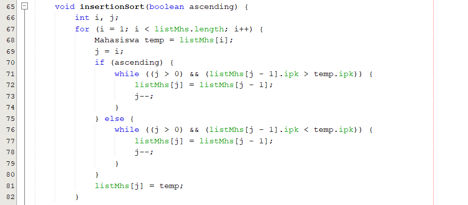

# Jawaban Pertanyaan

1. Proses Bubble Sort berada pada method bubbleSort() di class DaftarMahasiswaBerprestasi 
2. Proses Selection Sort berada pada method selectionSort() di class DaftarMahasiswaBerprestasi 
3. Proses swap adalah proses penukaran dua nilai elemen array dari suatu indeks ke indeks yang lain pada satu array. Potongan program swap:
 

4. Baris Program Method bubbleSort():

Proses ini merupakan proses utama algoritma bubble sort yaitu dengan membandingkan suatu indeks dengan indeks sebelumnya. Jika kondisi yang diberikan memenuhi, maka akan dilakukan proses swap atau penukaran. Misalnya ingin mengurutkan secara descending maka kondisi yang diberikan adalah jika listMhs[j].ipk > listMhs[j-1].ipk maka akan terjadi swap yaitu penukaran nilai elemen listMhs[j].ipk dengan nilai elemen listMhs[j-1].ipk

5. Perulangan pada method BubbleSort()

a) Perulangan  i digunakan untuk pada perulangan i memulai perulangan j dari awal, Sedangkan Perulangan j digunakan untuk perulangan j berada di dalam untuk melakukan penukaran indeks. b) Perulangan i adalah i < listMhs.lenth-1 memenuhi 2 proses perulangan namun dari index 0. c) Perulangan j adalah j < listMhs.lenth-i untuk memenuhi 2 proses perulangan namun mulai dari index 1. d) Perulangan i akan berlangsung sebanyak 49 kali. Banyak tahap bubbleSort ada  1225 

6. Kode Program pada method selectionSort()

Maksud proses tersebut untuk mencari nilai terkecil untuk dilakukan penukaran. Selection sort merupakan metode pengurutan dengan mencari nilai data terkecil dimulai dari data diposisi 0 hingga diposisi N-1. Jika terdapat N data dan data terkoleksi dari urutan 0 sampai dengan N-1. Selama proses, perbandingan dan pengubahan, hanya dilakukan pada indeks permbandingnya saja, pertukaran data secara fisik terjadi pada akhir proses. 

7. Modifikasi method insertion sort sehingga  fungsi ini dapat melakukan proses sorting dengan cara ascending atau descending berada pada project netbeans Jobsheet5 package Minggu5 nama file ModifDaftarMahasiswaBerprestasi.java dan ModifMain.java. Potongan program modif insertion sort:
