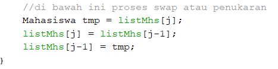
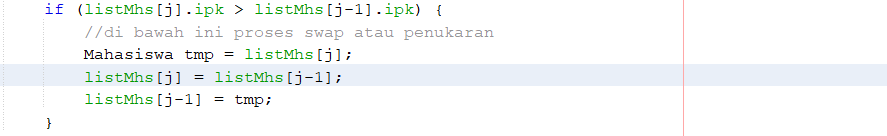

# Jawaban Pertanyaan

1. Proses Bubble Sort berada pada method bubbleSort() di class DaftarMahasiswaBerprestasi
2. Proses Selection Sort berada pada method selectionSort() di class DaftarMahasiswaBerprestasi
3. Proses swap adalah proses penukaran dua nilai elemen array dari suatu indeks ke indeks yang lain pada satu array. Potongan program swap:
 

4. Baris Program Method bubbleSort():

Proses ini merupakan proses utama algoritma bubble sort yaitu dengan membandingkan suatu indeks dengan indeks sebelumnya. Jika kondisi yang diberikan memenuhi, maka akan dilakukan proses swap atau penukaran. Misalnya ingin mengurutkan secara descending maka kondisi yang diberikan adalah jika listMhs[j].ipk > listMhs[j-1].ipk maka akan terjadi swap yaitu penukaran nilai elemen listMhs[j].ipk dengan nilai elemen listMhs[j-1].ipk