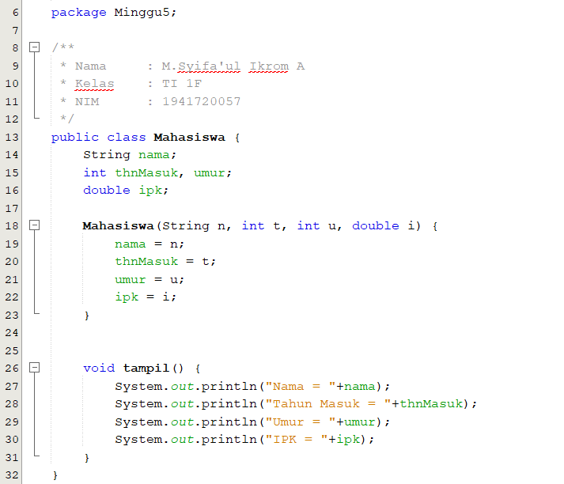
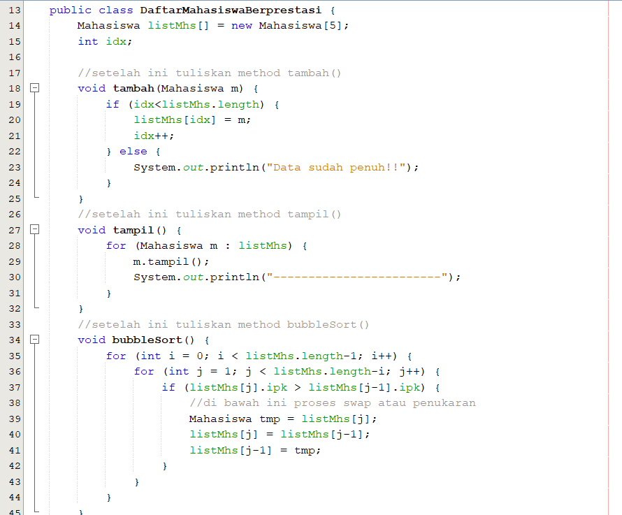
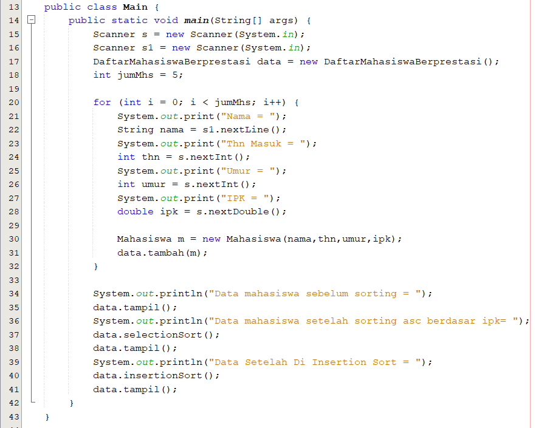
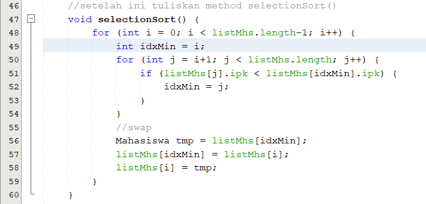
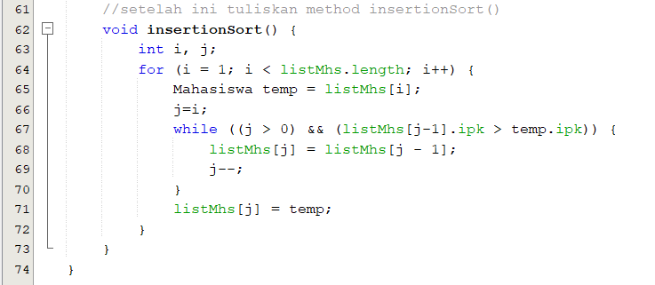

# Laporan Praktikum Bubble Sort, Selection Sort, dan Insertion Sort

## Praktikum 1 Membuat Class Mahasiswa

## Praktikum 2 Membuat Class DaftarMahasiswaBerprestasi dan Method Bubble Sort

## Praktikum 3 Membuat Class Main

## Praktikum 4 Menambahkan Proses Selection Sort

## Praktikum 5 Menambahkan Proses Insertion Sort

