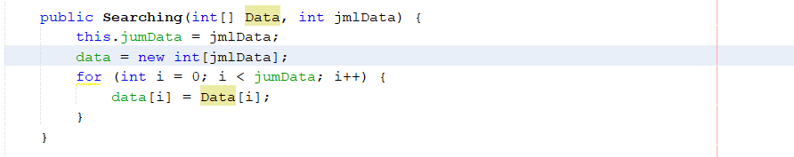
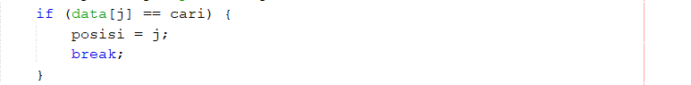
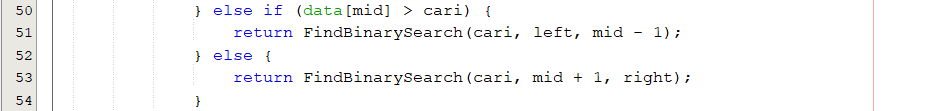
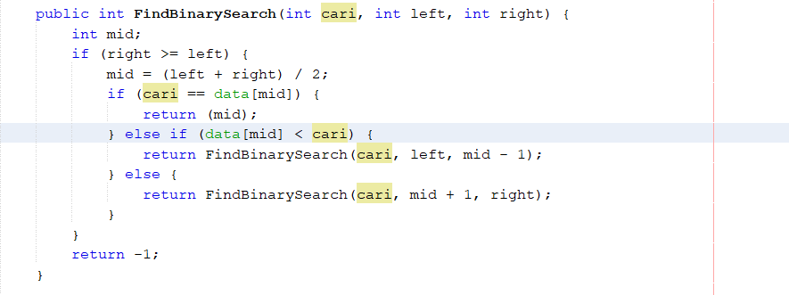

# Jawaban Pertanyaan Praktikum Sequential Search

1. Kode program :

Fungsi kode program tersebut adalah untuk membuat konstruktor dari kelas Searching yang memiliki parameter yang nantinya digunakan untuk memberi nilai atribut jumData dan atribut data[].

2. Kode program :

Fungsi break pada kode program tersebut adalah untuk menghentikan perulangan agar tidak melakukan pengecekan pada indeks selanjutnya. Kode break akan dijalankan jika kondisi yang diberikan memenuhi, pada kasus ini jika data yang dicari telah ditemukan, maka break akan dijalankan agar tidak mencari kembali data di indeks selanjutnya.

3. Program masih dapat berjalan dan hasil yang dikeluarkan benar karena pada algoritma sequential search pencarian dilakukan secara urut dari depan ke belakang hingga data yang dicari ditemukan. Jadi walau data yang disajikan tidak urut selagi data yang dicari terdapat pada array data tersebut maka data akan tetap dapat ditemukan.

# Jawaban Pertanyaan Praktikum Binary Search

1. Proses divide dijalankan pada method FindBinarySearch() di class Searching line ke 50-54. Potongan kode program :

2. Proses conquer dijalankan pada method FindBinarySearch() di class Searching line ke 50-54. Potongan kode program :

3. Hasil dari binary search tidak sesuai. Modifikasi program binary search agar hasil sesuai berada pada project netbeans Jobsheet7 package TestSearching nama file ModifSearching.java dan ModifSearchingMain.java. Potongan kode program :

4. Program tidak dapat berjalan karena data yang disajikan tidak terurut. Pada algoritma binary search data harus dalam kondisi terurut agar data yang dicari dapat ditemukan.

5. Modifikasi program agar data array dapat diinputkan atau bersifat dinamis berada di project netbeans Jobsheet7 package TestSearching nama file ModifSearchingMain.java