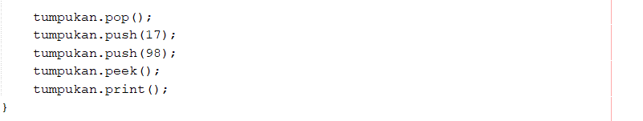
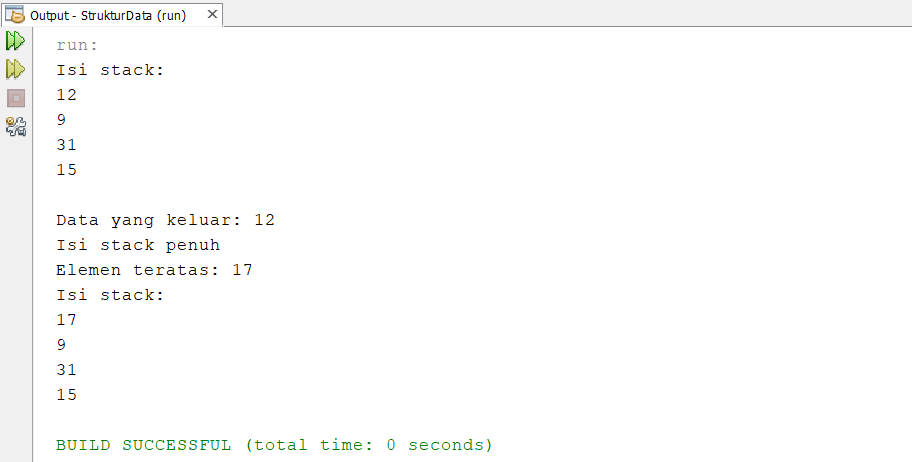

# Jawaban Pertanyaan 8.3.3 Praktikum 1

1. Kode Program :

Fungsi angka 4 pada kode program tersebut adalah memberi nilai pada parameter int size milik konstruktor Stack yang berada pada kelas Stack

2. Menambahkan data angka 17 dan 98 pada program :

Hasil run program :

3. Pada soal nomer 2, data yang dapat dimasukkan ke dalam stack hanya angka 17 sedangkan angka 98 tidak bisa dimasukkan karena ukuran stacknya hanya 4 dan sebelumnya stack sudah terisi 3 data jadi hanya satu data yang bisa dimasukkan lagi yaitu data angka 17 sedangkang data angka 98 tidak bisa dimasukkan karena stack sudah penuh

4. Modifikasi program sehingga pengguna dapat memasukkan data melalui keyboard dan membentuk menu program berada pada project netbeans StrukturData package minggu8 nama file ModifStack.java dan ModifStackMain.java

5. Pada konstruktor Stack variabel top diinisialisasi dengan nilai -1 karena array dimulai dari 0, yang berarti bahwa data stack dalam keadaan kosong

