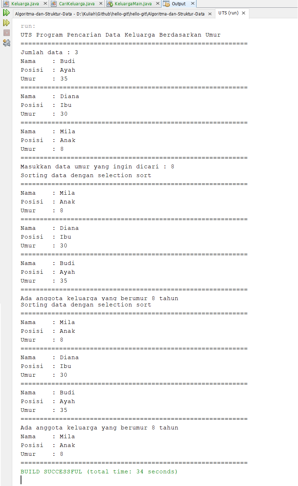

# Laporan UTS Praktikum Algoritma Struktur Data

1. Kode Program Class Keluarga

Kode program ini berisi atribut, konstruktor, dan method void tampil. Atribut yang dideklarasikan adalah String nama, String posisi, dan String umur yang nantinya akan digunakan dalam program. Konstruktor digunakan untuk mengisi nilai pada atribut. Method tampil() digunakan untuk menampilkan isi dari atribut.

2. Kode Program Class CariKeluarga

Kode program ini berisi atribut, array of objek keluarga, konstruktor, method tambah, method tampil(), method selectionSort(), method FindBinarySearch, dan method Tampilposisi.

3. Kode program Class KeluargaMain

Kode program ini berisi method main yang berfungsi untuk menjalankan program.

4. Output Program

Berisi output dari program yang dibuat.
