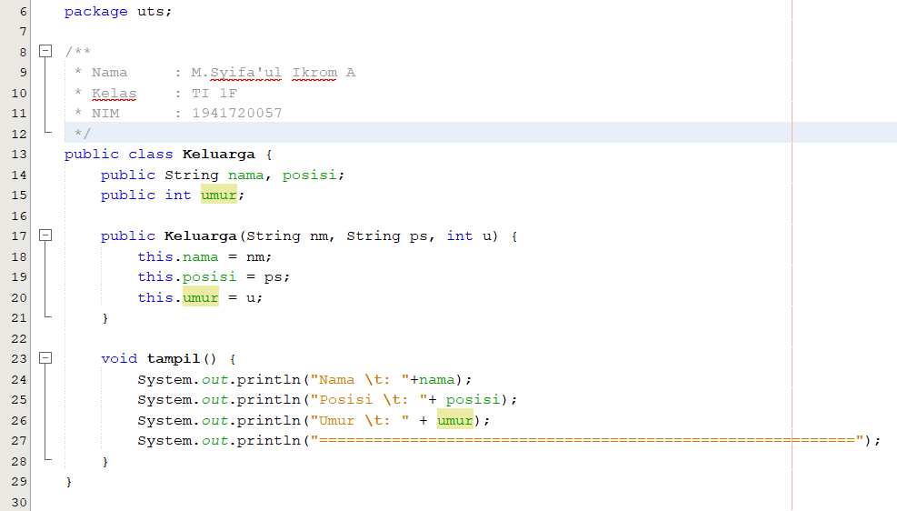
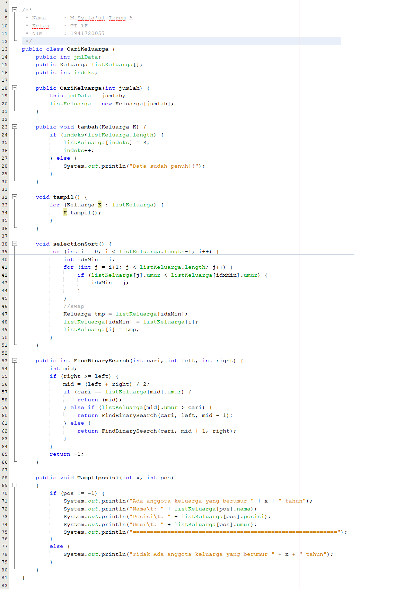
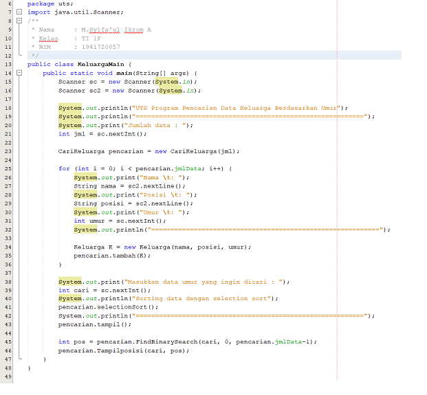
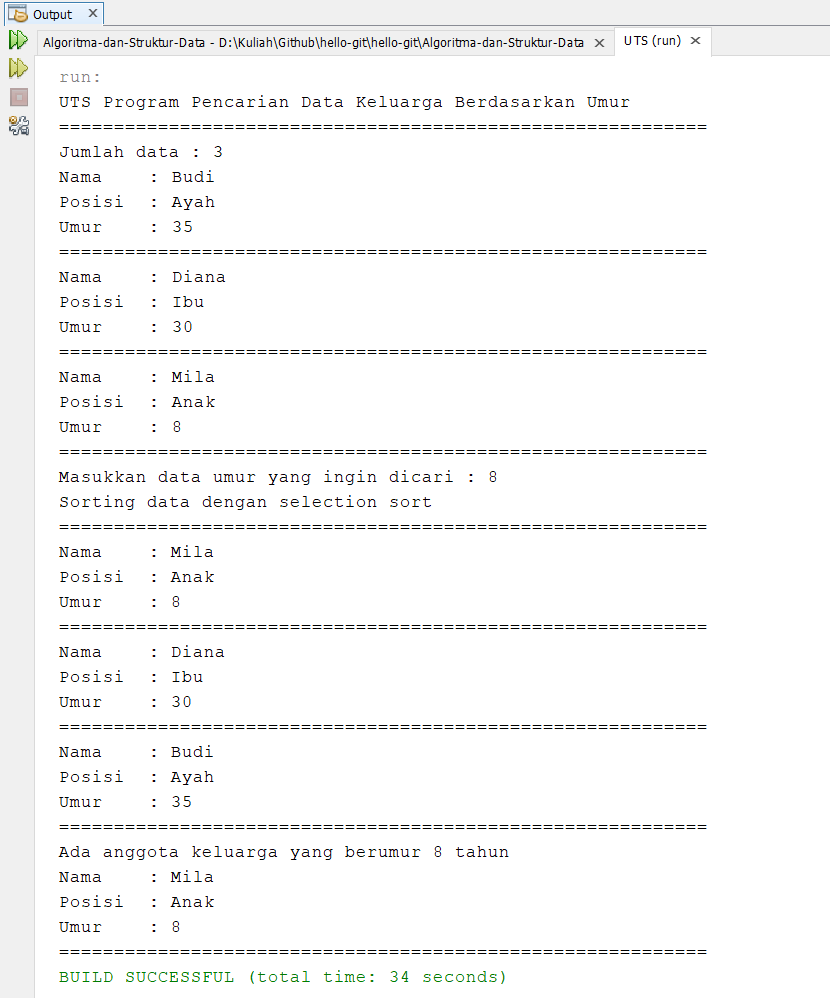

# Laporan UTS Praktikum Algoritma Struktur Data

1. Kode Program Class Keluarga

Kode program ini berisi atribut, konstruktor, dan method void tampil. Atribut yang dideklarasikan adalah String nama, String posisi, dan String umur yang nantinya akan digunakan dalam program. Konstruktor digunakan untuk mengisi nilai pada atribut. Method tampil() digunakan untuk menampilkan isi dari atribut.

2. Kode Program Class CariKeluarga

Kode program ini berisi atribut int jmlData dan int indeks, array of objek keluarga yaitu listKeluarga[], konstruktor digunakan untuk mengisi nilai atribut, method tambah digunakan untuk memasukkan data array of objek ke objek Keluarga K, method tampil() digunakan untuk menampilkan data, method selectionSort() digunakan untuk mengurutkan data keluarga berdasarkan umur, method FindBinarySearch digunakan untuk mencari data berdasarkan umur, dan method Tampilposisi digunakan untuk menampilkan bahwa data ditemukan atau tidak ditemukan.

3. Kode program Class KeluargaMain

Kode program ini berisi method main yang berfungsi untuk menjalankan program.

4. Output Program

Pada output program user mengisi jumlah data, kemudian mengisi nama, posisi, dan umur sebanyak jumlah data. Setelah itu, user menginputkan data umur yang ingin dicari. Program otomatis mengurutkan data dengan selection sort dan menampilkan keterangan data ditemukan atau data tidak ditemukan.
